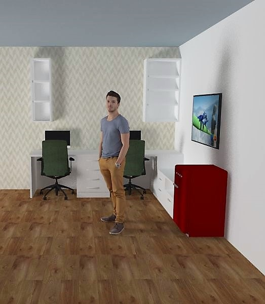

# RGB-D Dataset for Emotion-based Place Recognition

The camera configuration / preferences, the process to obtain these and the recording steps are described below in each separate section. The code and readme maintenance will be made according to next Master's phases.

# Camera configuration values

The camera used to capture the frames will be the `Intel RealSense R200`, which was designed to focus on medium distances and can capture RGB-D (color and depth data) with frame detection up to 60 fps. As this experiment has to worry about disk space limitations and the number of frames per second doesn't need to be too big in order to accomplish the task, the default value considered will be `30 fps`.

Intel RealSense R200 has support for recording of `rgb, depth and infrared` frames. In this project, all types will be used with the default resolution of `1920x1080` for RGB frame and `640x480` for depth/infrared frames. In this way, some intrisic techniques would be necessary in order to syncronize data from different image sizes. However, a better image quality for RGB frames will provide a better classification accuracy using Machine Learning or Deep Learning algorithms.

# Camera preferences process

Many configuration options are described into Intel RealSense SDK Documentation to work with R200 module on different scenarios. The open-source tool provided by Intel development kit called `cpp-config-ui` was used to obtain the best record preferences through a nice UI interface that allows real-time frame comparison.

The camera options below were choosen differing from default values and can be used for both C++/Python recording:
  - `rs_option.RS_OPTION_R200_LR_AUTO_EXPOSURE_ENABLED`: 1
  - `rs_option.RS_OPTION_R200_EMITTER_ENABLED`: 1
  - `rs_option.RS_OPTION_R200_LR_GAIN`: 2

In case of using Python it was also important to set these values below:
  - `depth_control_preset`: 5 
  - `ivcam_preset` = 8

# Record steps

The dataset will contain frame images acquired by a Intel Realsense R200 with approximately a height of `1 meter` (this value was chosen based on previous papers and the goal of avoid possible occlusions. 
In order to obtain data from general scenarios, it will be different indoor places:
  - `social`: Public indoor places such as gym and game room
  - `home`: Rooms such as living room
  - `workplace`: Indoor rooms such as office room and meeting room

As seen above, the focus on data collection will be `indoor places` in order to keep this project based on the scenario of a robot entering in an unknown place, trying to recognize the social state and deciding which action it will perform.

The labels are related to the more suitable action the robot could perform based on each social situation detected. The cross-tab below demonstrates the meaning of each label:

| Label  | Meaning | Action
| ------------- | ------------- | ------------- |
| Active  | engaging and involving in social situations | Robot enters in the room, starts and maintains a conversation with someone |
| Proactive  | trying to engage making a social action | Robot enters in the room trying to interact or giving someone a compliment |
| Inactive  | not engaging or involving in any social situation | Robot enters in the room quietly |

Each label will have `100 different sample` data collected to allow the analysis of different persons and place characteristics. For example, the “social” category will be obtained inside two different places (gym / game room). Moreover, the time record chosen was 8 seconds based on an appropriate period to recognize surrounding and individual features.

Some examples and their corresponding assigned labels are described below:

| Situation | Label | 
| ------------- | ------------- |
| Discrete group conversation in quiet office| Inactive |
| Person watching TV in the living room | Inactive |
| Person reading a book in quiet room| Inactive |
| People doing different activities and some of them directs their gaze to the robot | Proactive |
| Person looking at its cellphone and divert the attention to the robot | Proactive |
| People working in noisy office room | Proactive |
| People playing pool and start looking into the robot | Active |
| People in the gym looking to see who came in the door| Active |
| People came in robot direction and ask a question | Active |

The record number of each label in the dataset will be balanced in order to allow a better representation. In summary, the number of samples will be `300 records` based on different places and situations.

Some images produced with Sketchup 3D demonstrate the general idea:

